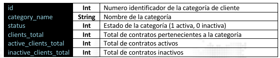

### Obtener las Categorías 

Este método entrega la información de las categorías o grupos de clientes a las cuales tiene acceso el 
token de sesión que se ha indicado en el encabezado. Para cada categoría obtendrá, el id único 
asignado, el nombre de la categoría, el estado (activo o inactivo) total de clientes, total de clientes 
activos, total de clientes inactivos.

> <span style="color:#2ECC71">GET</span> https://monitoreo.forcesos.com/api_corporate/public/api/clients/get-categories 

#### Ejemplos:
__Curl__
```bash
curl --location -
request GET 'https://monitoreo.forcesos.com/api_corporate/public/api/clients/get-categories' \ 
--header 'api-token: {token} '
```

__JAVA__
```java
OkHttpClient client = new OkHttpClient().newBuilder().build(); 
MediaType mediaType = MediaType.parse("text/plain"); 
RequestBody body = RequestBody.create(mediaType, ""); 
Request request = new Request.Builder() 
  .url("https://monitoreo.forcesos.com/api_corporate/public/api/clients/get-categories") 
  .method("GET", body) 
  .addHeader("api-token", "{token}") 
  .build(); 
Response response = client.newCall(request).execute();
```

__PowerShell__
```bash
$headers = New-Object "System.Collections.Generic.Dictionary[[String],[String]]" 
$headers.Add("api-token", "{token}") 
 
$response = Invoke-
RestMethod 'https://monitoreo.forcesos.com/api_corporate/public/api/clients/get-categories' 
Method 'GET' -Headers $headers 
$response | ConvertTo-Json 
```

#### Respuesta

La respuesta del recurso es entregada en formato JSON

Propiedades de la respuesta 


<table style="border-collapse:collapse; width:100%;">
  <tr>
    <td style="background:#333; color:#fff; padding:6px; width:120px;">data</td>
    <td style="border:1px solid #000; padding:6px;">Contiene un arreglo de objectos JSON con las informaciones del cliente</td>
  </tr>
</table> 



<table style="border-collapse:collapse; width:100%;">
  <tr>
    <td style="background: #333; color: #fff; padding: 8px; width: 120px; border: 1px solid #000;">status</td>
    <td style="padding: 8px; border: 1px solid #000;">
      Contiene la información de estado de la respuesta.
    </td>
  </tr>
</table>


#### Ejemplo de Respuesta
```json
 { 
    "data": [ 
        { 
            "id": "119", 
            "category_name": "1", 
            "status": "Active", 
            "clients_total": "939", 
            "active_clients_total": "896", 
            "inactive_clients_total": "43" 
        }, 
        { 
            "id": "268", 
            "category_name": "BASICO", 
            "status": "Active", 
            "clients_total": "8", 
            "active_clients_total": "3", 
            "inactive_clients_total": "5" 
        } 
    ], 
    "status": { 
        "status_code": "2000", 
        "status_message": "Success", 
        "description": "Respuesta de la petición web es correcta" 
    } 
}
```