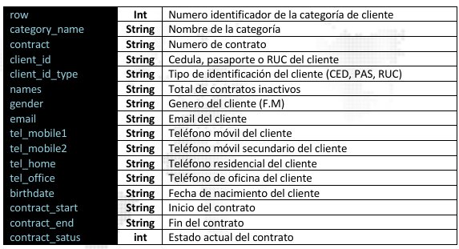

### Obtener Clientes por Categoría

Permite obtener el listado de clientes que tiene una de las categorías a las que tiene acceso el token de 
seguridad provisto en el encabezado.  

> <span style="color:#2ECC71">GET</span> https://monitoreo.forcesos.com/api_corporate/public/api/clients/get-clients-bycategory?={category} 

#### Ejemplos:
__Curl__
```bash
curl --location -
request GET 'https://monitoreo.forcesos.com/api_corporate/public/api/clients/get-clients-by
category?category= {category} \'
--header 'api-token: {token}'
```
__JAVA__
```java
OkHttpClient client = new OkHttpClient().newBuilder() 
  .build(); 
MediaType mediaType = MediaType.parse("text/plain"); 
RequestBody body = RequestBody.create(mediaType, ""); 
Request request = new Request.Builder() 
  .url("https://monitoreo.forcesos.com/api_corporate/public/api/clients/get-clients-by
category?category= {category} ") 
  .method("GET", body) 
  .addHeader("api-token", "{token}") 
  .build(); 
Response response = client.newCall(request).execute();
```

__PowerShell__
```bash
$headers = New-Object "System.Collections.Generic.Dictionary[[String],[String]]" 
$headers.Add("api-token", "{token}") 
 
$response = Invoke
RestMethod 'https://monitoreo.forcesos.com/api_corporate/public/api/clients/get-clients-by
category?category= {category}'
-Method 'GET' -Headers $headers
$response | ConvertTo-Json 
```


#### Respuesta

La respuesta del servicio viene en formato JSON

<table style="border-collapse:collapse; width:100%;">
  <tr>
    <td style="background:#333; color:#fff; padding:6px; width:120px;">data</td>
    <td style="border:1px solid #000; padding:6px;">Contiene un arreglo de objectos JSON con las informaciones de los clientes pertenecientes a 
la categoría provista </td>
  </tr>
</table> 



<table style="border-collapse:collapse; width:100%;">
  <tr>
    <td style="background: #333; color: #fff; padding: 8px; width: 120px; border: 1px solid #000;">status</td>
    <td style="padding: 8px; border: 1px solid #000;">
      Contiene la información de estado de la respuesta.
    </td>
  </tr>
</table>


#### Ejemplo de Respuesta

Si el token provisto tiene acceso a la categoría especificada, obtendrá una respuesta parecida a la 
siguiente 

```json
{ 
    "data": [ 
        { 
            "row": "1", 
            "category_name": "1", 
            "contract": "E5BD0A70", 
            "client_id": "2202190953", 
            "client_id_type": "PAS", 
            "names": "Prueba Durank_7516", 
            "gender": "f", 
            "email": "durank7516@gmail.com", 
            "tel_mobile1": "8296656555", 
            "tel_mobile2": "8291231133", 
            "tel_home": "8091231231", 
            "tel_office": "", 
            "birthdate": "1988-01-09 14:08:54.000", 
            "contract_start": "2019-02-22 13:54:26.173", 
            "contract_end": "2099-01-01 11:50:00.000", 
            "contract_status": "active" 
        } 
 
    ], 
    "status": { 
        "status_code": "2000", 
        "status_message": "Success", 
        "description": "Respuesta de la petición web es correcta" 
    } 
} 
```

Si el token no tiene acceso a la categoría solicitada o la categoría no existe

```json
{ 
    "msg": "Esta categoría no pertenece al corporativo", 
    "error": { 
        "status_code": "3004", 
        "status_message": "Not Found", 
        "description": "El recurso solicitado no existe" 
    } 
}
```