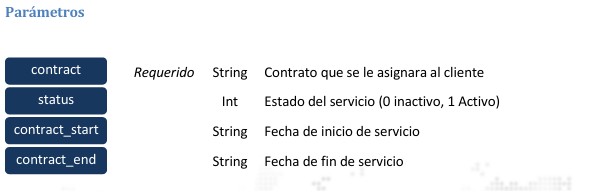

### Actulizar Contrato

Permite actualizar el estado, fecha inicio y fecha fin de un contrato existente. La información para 
actualizar para el contrato debe de enviarse en formato de formulario.



> <span style="color:blue">POST</span> https://monitoreo.forcesos.com/api_corporate/public/api/clients/update

#### Ejemplos:
__Curl__
```bash
curl --location --
request POST 'https://monitoreo.forcesos.com/api_corporate/public/api/clients/update' \ 
--header 'api-token: {token}' \ 
--form 'contract="{contract}"' \ 
--form 'contract_start="2022-02-22 00:00:00.000"' \ 
--form 'contract_end="2022-09-23 00:00:00.000"' \ 
--form 'status="1"' 
```

__JAVA__
```java
OkHttpClient client = new OkHttpClient().newBuilder() 
.build(); 
MediaType mediaType = MediaType.parse("text/plain"); 
RequestBody body = new MultipartBody.Builder().setType(MultipartBody.FORM) 
.addFormDataPart("contract","{contract}") 
.addFormDataPart("contract_start","2022-02-22 00:00:00.000") 
.addFormDataPart("contract_end","2022-09-23 00:00:00.000") 
.addFormDataPart("status","1") 
.build(); 
Request request = new Request.Builder() 
.url("https://monitoreo.forcesos.com/api_corporate/public/api/clients/update") 
.method("POST", body) 
.addHeader("api-token", "{token}") 
  .build(); 
Response response = client.newCall(request).execute();
```

__PowerShell__
```bash
$headers = New-Object "System.Collections.Generic.Dictionary[[String],[String]]" 
$headers.Add("api-token", "{token}") 
 
$multipartContent = [System.Net.Http.MultipartFormDataContent]::new() 
$stringHeader = [System.Net.Http.Headers.ContentDispositionHeaderValue]::new("form-data") 
$stringHeader.Name = "contract" 
$stringContent = [System.Net.Http.StringContent]::new("{contract}") 
$stringContent.Headers.ContentDisposition = $stringHeader 
$multipartContent.Add($stringContent) 
 
$stringHeader = [System.Net.Http.Headers.ContentDispositionHeaderValue]::new("form-data") 
$stringHeader.Name = "contract_start" 
$stringContent = [System.Net.Http.StringContent]::new("2022-02-22 00:00:00.000") 
$stringContent.Headers.ContentDisposition = $stringHeader 
$multipartContent.Add($stringContent) 
 
$stringHeader = [System.Net.Http.Headers.ContentDispositionHeaderValue]::new("form-data") 
$stringHeader.Name = "contract_end" 
$stringContent = [System.Net.Http.StringContent]::new("2022-09-23 00:00:00.000") 
$stringContent.Headers.ContentDisposition = $stringHeader 
$multipartContent.Add($stringContent) 
 
$stringHeader = [System.Net.Http.Headers.ContentDispositionHeaderValue]::new("form-data") 
$stringHeader.Name = "status" 
$stringContent = [System.Net.Http.StringContent]::new("1") 
$stringContent.Headers.ContentDisposition = $stringHeader 
$multipartContent.Add($stringContent) 
 
$body = $multipartContent 
 
$response = Invoke-
RestMethod 'https://monitoreo.forcesos.com/api_corporate/public/api/clients/update' 
Method 'POST' -Headers $headers -Body $body 
$response | ConvertTo-Json
```

#### Respuesta

La respuesta del servicio viene en formato JSON 

#### Ejemplo de Respuesta:

Si el token provisto tiene acceso a la categoría especificada, obtendrá una respuesta parecida a la 
siguiente 

Si el contrato a actualizar existe entre las categorías a las cuales tiene acceso y el proceso se ejecuta 
exitosamente obtendrá la siguiente respuesta

```json
{ 
    "contract": 779757, 
    "status": { 
        "status_code": "2000", 
        "status_message": "Success", 
        "description": "Respuesta de la petición web es correcta" 
    } 
} 
```

Si el contrato indicado no existe dentro de las categorías a las cuales tiene acceso obtendrá la siguiente 
respuesta

```json
{ 
    "msg": "El contrato no existe", 
    "errors": { 
        "status_code": "3000", 
        "status_message": "Bad request", 
       "description": "No puede procesarse la petición debido a que esta mal formulada la dirección o es incorrecta" 
    } 
}
```


Si la nueva fecha de fin es menor que la fecha de inicio existente

```json
{ 
    "msg": "La fecha inicial no puede ser mayor a la fecha final del contrato", 
    "error": { 
        "status_code": "5001", 
        "status_message": "Not Implemented", 
        "description": "La solicitud no se implementó" 
    } 
} 
```