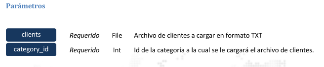

### Carga de Archivo de Clientes

Permite realizar la carga de un archivo TXT de clientes a través del servicio web, indicando el id de la 
categoría a la cual pertenecen los clientes del archivo. El formato del archivo a cargar debe ser el mismo 
descrito para la carga por SFTP.



> <span style="color:blue">POST</span> https://monitoreo.forcesos.com/api_corporate/public/api/clients/batch

#### Ejemplos:
__Curl__
```bash
curl --location --
request POST 'https://monitoreo.forcesos.com/api_corporate/public/api/clients/batch' \ 
--header 'api-token: {token}' \ 
--form 'clients=@"/C:/FTP/test.txt"' \ 
--form 'category_id="{category_id}"' 
```

__JAVA__
```java
OkHttpClient client = new OkHttpClient().newBuilder().build(); 
MediaType mediaType = MediaType.parse("text/plain"); 
RequestBody body = new MultipartBody.Builder().setType(MultipartBody.FORM) 
.addFormDataPart("clients","/C:/FTP/test.txt", 
RequestBody.create(MediaType.parse("application/octet-stream"), 
new File("/C:/FTP/test.txt"))) 
.addFormDataPart("category_id","{category_id}") 
.build(); 
Request request = new Request.Builder() 
.url("https://monitoreo.forcesos.com/api_corporate/public/api/clients/batch") 
.method("POST", body) 
.addHeader("api-token", "{token}")
  .build(); 
Response response = client.newCall(request).execute();
```

__PowerShell__
```bash
$headers = New-Object "System.Collections.Generic.Dictionary[[String],[String]]" 
$headers.Add("api-token", "{token}") 
 
$multipartContent = [System.Net.Http.MultipartFormDataContent]::new() 
$multipartFile = '/C:/FTP/test.txt' 
$FileStream = [System.IO.FileStream]::new($multipartFile, [System.IO.FileMode]::Open) 
$fileHeader = [System.Net.Http.Headers.ContentDispositionHeaderValue]::new("form-data") 
$fileHeader.Name = "clients" 
$fileHeader.FileName = "/C:/FTP/test.txt" 
$fileContent = [System.Net.Http.StreamContent]::new($FileStream) 
$fileContent.Headers.ContentDisposition = $fileHeader 
$multipartContent.Add($fileContent) 
 
$stringHeader = [System.Net.Http.Headers.ContentDispositionHeaderValue]::new("form-data") 
$stringHeader.Name = "category_id" 
$stringContent = [System.Net.Http.StringContent]::new("{category_id}") 
$stringContent.Headers.ContentDisposition = $stringHeader 
$multipartContent.Add($stringContent) 
 
$body = $multipartContent 
 
$response = Invoke-
RestMethod 'https://monitoreo.forcesos.com/api_corporate/public/api/clients/batch' 
Method 'POST' -Headers $headers -Body $body 
$response | ConvertTo-Json 
```

#### Respuesta

La respuesta del servicio viene en formato JSON 

#### Ejemplo de Respuesta:

Si el token provisto tiene acceso a la categoría especificada, y el archivo pasa la validación de manera 
satisfactoria se obtendrá la información de la acción a realizar para el archivo, el total de líneas 
validadas, el id de lote y la fecha. 

```json
{ 
    "action": "replace", 
    "total_rows": 479, 
    "msg": "Lote validato!", 
    "import_id": "5845", 
    "date": "2022-08-11 20:08:15" 
}
```
