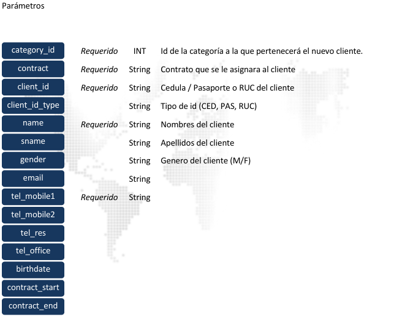

### Crear Cliente

Permite crear un nuevo cliente en una de las categorías a las cuales tiene acceso el token provisto en el 
encabezado. 
Al crear un nuevo cliente se deberá proveer la siguiente información:
<br>



La información del cliente a crear es enviada al servicio web en formato de formulario.

> <span style="color:blue">POST</span> https://monitoreo.forcesos.com/api_corporate/public/api/clients/  

#### Ejemplos:
__Curl__
```bash
curl --location --
request POST 'https://monitoreo.forcesos.com/api_corporate/public/api/clients' \ 
--header 'api-token: {token}' \ 
--form 'category_id="100"' \ 
--form 'contract="22500211700"' \ 
--form 'client_id="22500211700"' \ 
--form 'client_id_type="ced"' \ 
--form 'name="Jacinto2"' \ 
--form 'sname="Barba Blanca"' \ 
--form 'gender="m"' \ 
--form 'email="jacinto2@forcesos.com"' \ 
--form 'tel_mobile1="829333555"' \ 
--form 'tel_mobil2="829333555"' \ 
--form 'tel_res="829333555"' \ 
--form 'tel_office="829333555"' \ 
--form 'birthdate="1983-02-01"' \ 
--form 'contract_start="2022-02-22"' \ 
--form 'contract_end="2022-02-23"' 
```

__JAVA__
```java
OkHttpClient client = new OkHttpClient().newBuilder().build(); 
MediaType mediaType = MediaType.parse("text/plain"); 
RequestBody body = new MultipartBody.Builder().setType(MultipartBody.FORM) 
  .addFormDataPart("category_id","100") 
  .addFormDataPart("contract","22500211700") 
  .addFormDataPart("client_id","22500211700") 
  .addFormDataPart("client_id_type","ced") 
  .addFormDataPart("name","Jacinto2") 
  .addFormDataPart("sname","Barba Blanca") 
  .addFormDataPart("gender","m") 
  .addFormDataPart("email","jacinto2@forcesos.com") 
  .addFormDataPart("tel_mobile1","829333555") 
  .addFormDataPart("tel_mobil2","829333555") 
  .addFormDataPart("tel_res","829333555") 
  .addFormDataPart("tel_office","829333555") 
  .addFormDataPart("birthdate","1983-02-01") 
  .addFormDataPart("contract_start","2022-02-22") 
  .addFormDataPart("contract_end","2022-02-23") 
  .build(); 
Request request = new Request.Builder() 
  .url("https://monitoreo.forcesos.com/api_corporate/public/api/clients")
    .method("POST", body) 
    .addHeader("api-token", "{token}") 
    .build(); 
Response response = client.newCall(request).execute(); 
```

__PowerShell__
```bash
$headers = New-Object "System.Collections.Generic.Dictionary[[String],[String]]" 
$headers.Add("api-token", {token})
 
$multipartContent = [System.Net.Http.MultipartFormDataContent]::new() 
$stringHeader = [System.Net.Http.Headers.ContentDispositionHeaderValue]::new("form-data") 
$stringHeader.Name = "category_id" 
$stringContent = [System.Net.Http.StringContent]::new("100") 
$stringContent.Headers.ContentDisposition = $stringHeader 
$multipartContent.Add($stringContent) 
 
$stringHeader = [System.Net.Http.Headers.ContentDispositionHeaderValue]::new("form-data") 
$stringHeader.Name = "contract" 
$stringContent = [System.Net.Http.StringContent]::new("22500211700") 
$stringContent.Headers.ContentDisposition = $stringHeader 
$multipartContent.Add($stringContent) 
 
$stringHeader = [System.Net.Http.Headers.ContentDispositionHeaderValue]::new("form-data") 
$stringHeader.Name = "client_id" 
$stringContent = [System.Net.Http.StringContent]::new("22500211700") 
$stringContent.Headers.ContentDisposition = $stringHeader 
$multipartContent.Add($stringContent) 
 
$stringHeader = [System.Net.Http.Headers.ContentDispositionHeaderValue]::new("form-data") 
$stringHeader.Name = "client_id_type" 
$stringContent = [System.Net.Http.StringContent]::new("ced") 
$stringContent.Headers.ContentDisposition = $stringHeader 
$multipartContent.Add($stringContent) 
 
$stringHeader = [System.Net.Http.Headers.ContentDispositionHeaderValue]::new("form-data") 
$stringHeader.Name = "name" 
$stringContent = [System.Net.Http.StringContent]::new("Jacinto2") 
$stringContent.Headers.ContentDisposition = $stringHeader 
$multipartContent.Add($stringContent) 
 
$stringHeader = [System.Net.Http.Headers.ContentDispositionHeaderValue]::new("form-data") 
$stringHeader.Name = "sname" 
$stringContent = [System.Net.Http.StringContent]::new("Barba Blanca") 
$stringContent.Headers.ContentDisposition = $stringHeader 
$multipartContent.Add($stringContent) 
 
$stringHeader = [System.Net.Http.Headers.ContentDispositionHeaderValue]::new("form-data") 
$stringHeader.Name = "gender" 
$stringContent = [System.Net.Http.StringContent]::new("m") 
$stringContent.Headers.ContentDisposition = $stringHeader 
$multipartContent.Add($stringContent) 
 
$stringHeader = [System.Net.Http.Headers.ContentDispositionHeaderValue]::new("form-data") 
$stringHeader.Name = "email" 
$stringContent = [System.Net.Http.StringContent]::new("jacinto2@forcesos.com") 
$stringContent.Headers.ContentDisposition = $stringHeader 
$multipartContent.Add($stringContent) 
 
$stringHeader = [System.Net.Http.Headers.ContentDispositionHeaderValue]::new("form-data") 
$stringHeader.Name = "tel_mobile1" 
$stringContent = [System.Net.Http.StringContent]::new("829333555") 
$stringContent.Headers.ContentDisposition = $stringHeader 
$multipartContent.Add($stringContent) 
 
$stringHeader = [System.Net.Http.Headers.ContentDispositionHeaderValue]::new("form-data") 
$stringHeader.Name = "tel_mobil2" 
$stringContent = [System.Net.Http.StringContent]::new("829333555") 
$stringContent.Headers.ContentDisposition = $stringHeader 
$multipartContent.Add($stringContent) 
 
$stringHeader = [System.Net.Http.Headers.ContentDispositionHeaderValue]::new("form-data") 
$stringHeader.Name = "tel_res" 
$stringContent = [System.Net.Http.StringContent]::new("829333555") 
$stringContent.Headers.ContentDisposition = $stringHeader 
$multipartContent.Add($stringContent) 
 
$stringHeader = [System.Net.Http.Headers.ContentDispositionHeaderValue]::new("form-data") 
$stringHeader.Name = "tel_office" 
$stringContent = [System.Net.Http.StringContent]::new("829333555") 
$stringContent.Headers.ContentDisposition = $stringHeader 
$multipartContent.Add($stringContent) 
 
$stringHeader = [System.Net.Http.Headers.ContentDispositionHeaderValue]::new("form-data") 
$stringHeader.Name = "birthdate" 
$stringContent = [System.Net.Http.StringContent]::new("1983-02-01") 
$stringContent.Headers.ContentDisposition = $stringHeader 
$multipartContent.Add($stringContent) 
 
$stringHeader = [System.Net.Http.Headers.ContentDispositionHeaderValue]::new("form-data") 
$stringHeader.Name = "contract_start" 
$stringContent = [System.Net.Http.StringContent]::new("2022-02-22") 
$stringContent.Headers.ContentDisposition = $stringHeader 
$multipartContent.Add($stringContent) 
 
$stringHeader = [System.Net.Http.Headers.ContentDispositionHeaderValue]::new("form-data") 
$stringHeader.Name = "contract_end" 
$stringContent = [System.Net.Http.StringContent]::new("2022-02-23") 
$stringContent.Headers.ContentDisposition = $stringHeader 
$multipartContent.Add($stringContent) 
 
$body = $multipartContent 
 
$response = Invoke-
RestMethod 'https://monitoreo.forcesos.com/api_corporate/public/api/clients' 
-Method 'POST' 
-Headers $headers 
-Body $body 
$response | ConvertTo-Json 
```

#### Respuesta

La respuesta del servicio viene en formato JSON


<table style="border-collapse:collapse; width:100%;">
  <tr>
    <td style="background:#333; color:#fff; padding:6px; width:120px;">client</td>
    <td style="border:1px solid #000; padding:6px;">Id numérico del nuevo cliente creado</td>
  </tr>

  <tr>
    <td style="background:#333; color:#fff; padding:6px;">contract</td>
    <td style="border:1px solid #000; padding:6px;">Id numérico del nuevo contrato creado</td>
  </tr>

  <tr>
    <td style="background:#333; color:#fff; padding:6px;">status</td>
    <td style="border:1px solid #000; padding:6px;">Contiene la información de estado de la respuesta.</td>
  </tr>
</table>

#### Ejemplo de Respuesta:

Si el token provisto tiene acceso a la categoría especificada, obtendrá una respuesta parecida a la 
siguiente 

```json
{ 
    "client": "724983", 
    "contract": "845513", 
    "status": { 
        "status_code": "2000", 
        "status_message": "Success", 
        "description": "Respuesta de la petición web es correcta" 
    } 
} 
```

Si intenta crear un nuevo cliente con un número de teléfono ya existente en la base de datos para otro 
cliente obtendrá la siguiente respuesta:

```json
{ 
    "msg": "Ya existe un cliente con éste número de teléfono", 
    "parameter": "829333555", 
    "error": { 
        "status_code": "5001", 
        "status_message": "Not Implemented", 
        "description": "La solicitud no se implementó" 
    } 
} 
```

Si al intentar crear un nuevo cliente indicando una categoría inexistente o a la cual no tiene acceso 
obtendrá la siguiente respuesta.

```json
{ 
    "msg": "Esta categoría no pertenece al corporativo", 
    "error": { 
        "status_code": "3004", 
        "status_message": "Not Found", 
        "description": "El recurso solicitado no existe" 
    } 
}
```