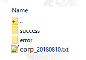

### Manejo de Información vía SFTP

Al gestionar la información de afiliados usando la solución de SFTP, deberá copiar el archivo con la base 
de clientes a la dirección __SFTP__ que se muestra más abajo usando las credenciales que se le hayan 
entregado. 

Una vez depositado el archivo el sistema de manera automática cargará la información del archivo en a 
una cola de trabajo y el procesamiento de este iniciará a horas de la madrugada del día siguiente. 

#### Acceso
``` text
Servidor¹: corpftp.forcesos.com 
Puertos: 2002,2022 
```

Al acceder con el usuario y claves que le han sido entregado el cliente SFTP le mostrará una ventana 
parecida a la imagen siguiente:




Debe depositar el archivo a procesar en la raíz de su ftp, tal cual se muestra en la imagen. Al procesarse 
el archivo este será movido de manera automática a la carpeta __success__ si se ha procesado con éxito de 
lo contrario será movido a la carpeta __error__.

#### Nomenclatura del nombre del archivo

El archivo debe de tener uno de los siguientes formatos:

1) **[`nombre`] _ [`accion`]_[`fecha`].TXT**  
2) **[`nombre`]_[`fecha`].TXT**


<br>

__[`nombre`]__ Se indicará el nombre de la cartera o la organización. Este nombre solo debe incluir letras o números.  <br>

__[`acción`]__ Acción que se desea realizar con el archivo en relación con la base actual de clientes.

<br>

¹La dirección IP asociada al nombre de dominio corpftp.forcesos.com puede cambiar a medida que se 
implementan mejoras a nuestra infraestructura. Por lo que es recomendable utilizar el dominio para la 
configuración del cliente SFTP y no la dirección IP.  

**C** – Se cancelarán todos los clientes que se encuentren activos en el archivo, aquellos 
que existan en la base de datos y no estén en el archivo quedarán activos. 

**R** – Se reemplazará la base activa actual con la del archivo. Los clientes que existan en la 
base de datos y no estén en el archivo serán cancelados, aquellos que no estén en la 
base actual y estén en el archivo serán creados, aquellos que estén en el archivo y en la 
base serán actualizados. (Acción por defecto que se realizará si se usa el formato 2 para 
el nombre). 

**I** – Se agregarán los clientes del archivo en la base de datos. Los clientes que existan en 
la base y en el archivo serán actualizados, los que no existan en la base serán creados. 

<br>

__[`Fecha`]__ Fecha del archivo en formato YYYYMMDD.</p>


#### Ejemplos:

**Formato 1:**  

- **Cancelar clientes:** OrganizaciónA_<span style="color:red">C</span>_20180831.TXT 
- **Adicionar Clientes:** OrganizaciónA_<span style="color:red">I</span>_20180831.TXT 
- **Reemplazar Clientes:** OrganizaciónA_<span style="color:red">R</span>_20180831.TXT

**Formato 2:**  

- **Reemplazar clientes:** OrganizaciónB_20180831.TXT 

#### Procesado de información:

El sistema procesará el archivo cuya fecha indicada en el nombre corresponda a la fecha del día en que 
corre el proceso. Es decir, si se pone una fecha anterior, el archivo no será procesado, si se pone una 
fecha futura, el archivo se procesará en la fecha indicada. Si se ha programado una dirección de 
notificación para la organización esta recibirá una notificación de resumen de la carga realizada. 
Cualquier error en la nomenclatura del nombre del archivo podrá ocasionar que este no sea procesado. 

#### Clientes SFTP:

Puede usar cualquier cliente SFTP de su preferencia. Pero aquí le damos algunas recomendaciones.

**WinSCP**

   [https://winscp.net/](https://winscp.net/)

**FileZilla**

 [https://filezilla-project.org/](https://filezilla-project.org/)

