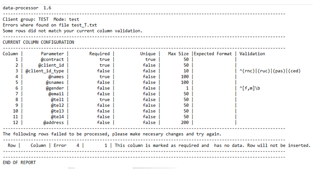

### Procesamiento de Datos Vía Correo Electrónico

Se dispone de un servicio de recepción de datos por correo electrónico que procesa los archivos 
recibidos en el buzón **data@forcesos.com**.

Para el uso de esta vía, el cliente corporativo debe proveer el buzón de correo que utilizará para el envío 
de los archivos de datos, la cual será incluida como dirección permitida para la recepción de datos de 
clientes del corporativo. Si el corporativo usa otra dirección de correo, el archivo enviado será eliminado 
sin ser procesado.

#### Formato de archivo

El formato del archivo a enviar debe ser el mismo descrito en la sección *__Manejo de información vía__* 
*__carga de archivo TXT__*, de la misma forma el nombre del archivo debe ser el mismo al descrito en la 
sección *__Nomenclatura de nombre del archivo__*. 

Al acceder con el usuario y claves que le han sido entregado el cliente SFTP le mostrará una ventana 
parecida a la imagen siguiente:

#### Procesado del archivo

Luego de enviar un archivo para su procesamiento, el servicio le retornará un correo informativo con 
información sobre la validación 

```bash
File received Test.txt 

TotalRows 14203 
ValidRows 14202 
FailedRows 0 
Action REPLACE 
Ratio RATIO 

Your data was successfully queued. process id: 5752  
File processing time 00:00:07.722 
```

#### Manejo de errores

Si el archivo recibido por el servicio de procesamiento de datos falla la validación, se le enviará un correo 
al remitente con el detalle de las fallas encontradas y la información sobre las validaciones que se están 
aplicando para cada columna del archivo.  



#### Pruebas

El servicio de procesamiento de datos le permite realizar pruebas de validación de un archivo sin que se 
afecte la base de clientes. 

Al enviar en el formato del nombre del archivo el parámetro de acción T, el servicio únicamente 
realizará la validación del archivo y enviará un correo al remitente con los resultados de este.

Ejemolo:

`CLIENTE1_T.TXT `

