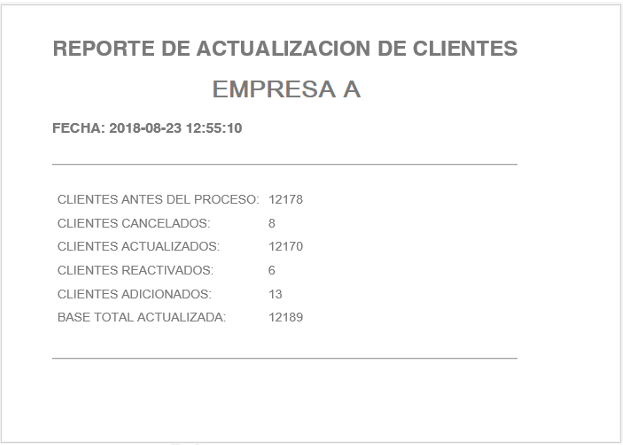

### Reporte de Procesamiento de Lote de Datos

Al terminar el procesamiento de un lote de clientes, se genera un reporte donde se resumen las 
acciones realizadas por el proceso. 

*Nota*: *El formato y datos que se presentan en este reporte podrán cambiar sin notificación previa*.